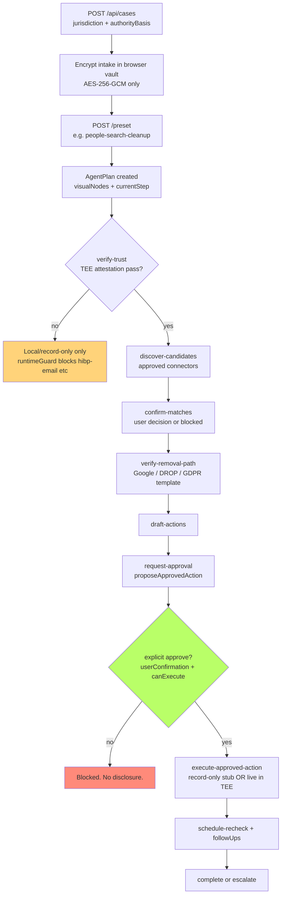

# Oblivion

Private supervised agent for online identity cleanup. Encrypted in the browser. Server stores only ciphertext + redacted metadata. Every disclosure stops at an explicit approval gate.

## Quick Start

```sh
npm install
cp .env.example .env   # then fill in API keys and wallet addresses
npm run dev
```

Open http://localhost:8080.

**New here?** Read the step-by-step walkthrough: [`docs/USER_GUIDE.md`](docs/USER_GUIDE.md) or open [/help](http://localhost:8080/help) while the app is running.

```sh
npm run verify   # build:client + test + typecheck + design:lint
npm test
npm run e2e
```

## Agent Lifecycle (record-only until TEE pass)



Record-only executor by default. Live paths gated behind policy + attestation + approval.

## Trust Model

- Vault: client-side only. Server cannot decrypt.
- Actions: propose → policy check → Approval record (dest, identifiers, dataToDisclose, purpose, risk, expiry) → explicit userConfirmation → canExecuteWithApproval → execute.
- Sensitive: assertSensitiveExecutionAllowed requires verifierResult: "pass" (Phala TDX quote, pinned images, compose match, fresh).
- Redaction + safe logging on every timeline, export, connector result, and log.
- Approved disclosures still go to third parties (broker, controller, HIBP, Google). The model minimizes infrastructure trust and prevents broad consent.

## What Works Locally

- All 6 presets, approval-gated and high-autonomy batch plans.
- Encrypted intake, redacted scope, policy blocks (SSN, password, dark web terms, source verification).
- **Exposure discovery**: paste profile URLs and/or Brave Search (`BRAVE_SEARCH_API_KEY`) + Venice/heuristic match scoring; confirm or reject each link before opt-out drafting.
- Safe HIBP prefix range check, Google removal plan, California DROP guidance, GDPR templates.
- Record-only execution by default (`OBLIVION_EXECUTOR_MODE=live` for connector handoff paths). Broker opt-outs are drafted, approved, then recorded—not silently deleted site-wide.
- Hackathon adapters (MetaMask EIP-7702/ERC-7715, x402 + ERC-7710, Venice redacted AI, A2A delegation, 1Shot relay) behind the same gates.
- Trust Center + /trust/attestation (not-configured locally until PHALA_ATTESTATION_URL set).

## Production / Phala

See `docker-compose.phala.yml`, `Dockerfile`, `config/trust-center.json`, and `SECURITY.md`.

Required env for TEE-enabled:

```sh
TRUST_CENTER_PATH=...
PHALA_ATTESTATION_URL=...
OBLIVION_EXECUTOR_MODE=record-only
OBLIVION_DISABLE_PLAINTEXT_LOGS=true
```

Confirm `GET /api/trust/attestation` returns `verifierResult: "pass"` before enabling sensitive connectors.

Optional hackathon wallet (MetaMask Smart Account demo / live Sepolia):

```sh
WALLET_LIVE_MODE=true          # enable wallet_sendCalls upgrade path in the browser
WALLET_CHAIN_ID=11155111       # Sepolia (default)
```

### Live integrations (hackathon + production)

Copy [`.env.example`](.env.example) to `.env` and configure:

| Variable | Purpose |
|----------|---------|
| `BRAVE_SEARCH_API_KEY` | People-search URL discovery (redacted query from case labels) |
| `VENICE_API_KEY` | Live agent classify / draft / review / chat + match scoring |
| `X402_PAY_TO` + `X402_FACILITATOR_URL` | Real HTTP 402 settlement on `/api/agent/premium-task` and `/api/agent/monitor` |
| `ONESHOT_BASE_URL` | 1Shot public relayer JSON-RPC (default `https://relayer.1shotapi.com/relayers`) |
| `HIBP_API_KEY` | Live breach email check (TEE attestation pass required) |
| `OBLIVION_EXECUTOR_MODE=live` | Run approved connectors after policy + approval (still gated by TEE for managed plaintext) |
| `PHALA_ATTESTATION_URL` | TDX quote verification before sensitive connectors |

Check readiness: `GET /api/integrations/status` · x402 buyer config: `GET /api/x402/config`

## Docs

- [`docs/USER_GUIDE.md`](docs/USER_GUIDE.md) — **step-by-step guide for users** (also at `/help` when the server is running).
- `AGENTS.md` — for AI agents and maintainers (invariants, safety checklists, test gaps, how to add connectors).
- `DESIGN.md` — visual language, colors, components.
- `SECURITY.md` — never-store rules, approval boundary, production requirements.
- `docs/HACKATHON_DEMO.md` — 3-minute flow and track checklist.

## API Surface (core)

Cases, intake, presets/plans, propose/approve/execute, connectors (hibp safe + google), trust, agent run, hackathon demos, export/delete.

See `src/api/app.ts` for routes. All disclosure paths enforce the gates above.
