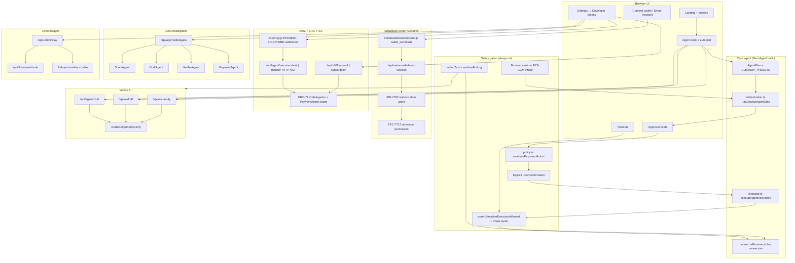
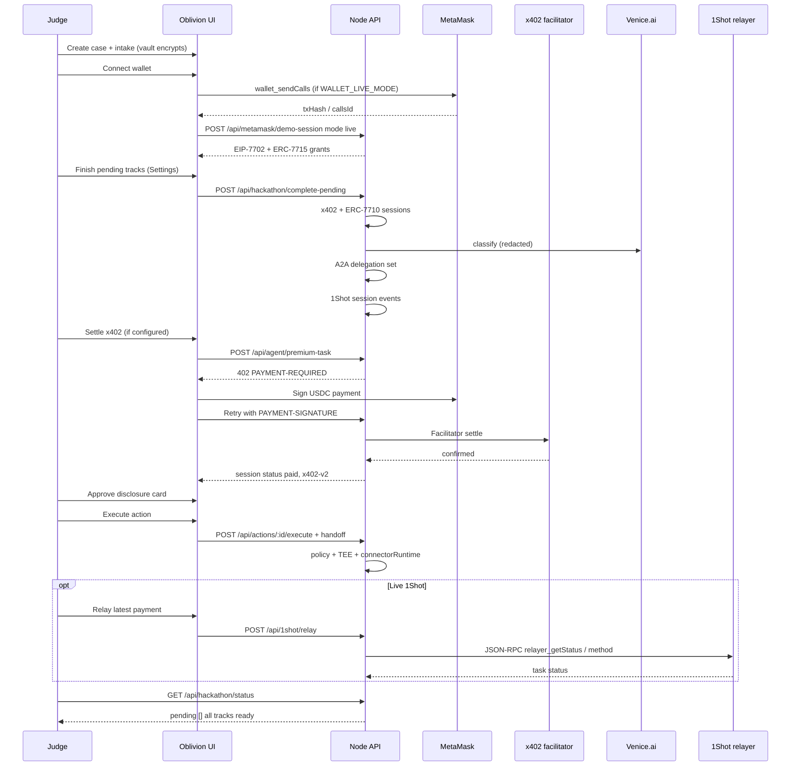

# Oblivion Hackathon Demo

## Pitch

Oblivion is a private online identity cleanup agent network. Traditional removal services ask users to hand over the identity they want protected. Oblivion keeps case contents encrypted, gates sensitive work on explicit approvals, and uses crypto-native permissions and payments to coordinate cleanup tasks.

Every hackathon adapter runs **behind the same gates** as production paths: browser vault for raw identifiers, propose → approve → execute, redaction, and attestation for managed plaintext. Nothing in the checklist bypasses those gates.

---

## Hackathon coverage map

This diagram shows how each sponsor track connects to real code paths (not UI-only theater).



---

## Track status matrix

Use `GET /api/integrations/status` for a live JSON snapshot. The table below is the source of truth for **what is fully wired** vs what needs env keys.

| Track | UI / API entry | Implementation | Live when | Demo / session fallback | Intentionally gated |
|-------|----------------|----------------|-----------|-------------------------|---------------------|
| **Best Agent** | Presets, agent dock, `/api/cases/:id/agent/run-next` | `orchestration.ts`, `cleanup.ts`, approvals, connectors | Always (core product) | `OBLIVION_EXECUTOR_MODE=record-only` records packets without external calls | Policy blocks password/SSN disclosure; dark-web terms blocked |
| **MetaMask Smart Accounts** | Connect wallet, Enable Smart Account | `metamaskSmartAccount.js`, `/api/metamask/demo-session` | `WALLET_LIVE_MODE=true` + MetaMask Sepolia `wallet_sendCalls` | Demo mode: EIP-7702 + ERC-7715 grants + deterministic smart-account display | User must confirm in wallet for live upgrade |
| **x402 one-off** | Onboarding payment, Settings → Payment rails | `hackathon.ts` sessions, `x402.ts` HTTP 402, `x402Pay.js` client settlement | `X402_PAY_TO` + `X402_FACILITATOR_URL`; sessions use **`x402-v2`** | Without pay-to: session `authorized` (not `paid`) — checklist still completes | Settlement does not bypass cleanup approvals |
| **ERC-7710 subscription** | Weekly monitor product | `createPaymentSession(subscription)`, scoped `PaymentAgent` delegation | Same as x402 (shared facilitator) | Demo `authorized` session + valid delegation objects | Spend cap + narrow scope validated in `validateErc7710Delegation` |
| **Venice AI** | Classify / Draft / Review buttons, agent chat | `venice.ts` → Venice chat API, redacted JSON output | `VENICE_API_KEY` set | `VENICE_DEMO_FALLBACK=true` → local `venice-demo` output; `liveReady.venice` true | `/api/agent/chat` returns 503 without API key or demo fallback |
| **A2A redelegation** | Delegate sub-agents | `createAgentDelegationSet` → 4 scoped agents + timeline | Always once `/api/agents/delegate` or **Finish pending tracks** runs | In-memory grants (not external A2A wire protocol) | Broad scopes rejected (`erc7710-scope-too-broad`) |
| **1Shot relayer** | Relay latest payment | `oneshot.ts` JSON-RPC to `ONESHOT_BASE_URL` | `ONESHOT_API_KEY` + `method`/`taskId` on relay | `ONESHOT_DEMO_FALLBACK=true` or **Finish pending tracks** with API key/demo → `createRelayerEvents`; `liveReady.oneShot` true when key or demo fallback | Relay without payload returns 422 |

### Connector extras (not separate hackathon tabs, but real)

| Capability | Live when | Notes |
|------------|-----------|--------|
| Brave exposure discovery | `BRAVE_SEARCH_API_KEY` | Redacted labels only |
| HIBP password range | Always (prefix-only) | No full password leaves browser |
| HIBP email | `HIBP_API_KEY` + TEE pass | Managed plaintext |
| Broker email opt-out | `RESEND_API_KEY` or `SMTP_*` | After approval + live executor |
| Broker web-form probe | `BROKER_WEBFORM_AUTOMATION=true` | GET opt-out page, map fields; no auto-submit; CAPTCHA → user handoff |
| Platform abuse email | Same as broker email | Content-takedown: DMCA + platform-abuse cards per URL |
| Live executor | `OBLIVION_EXECUTOR_MODE=live` | Sensitive connectors still need TEE pass |

---

## End-to-end judge flow



---

## 3-minute demo script

1. `0:00-0:30` **Problem**: identity cleanup usually requires trusting another company with PII. Show encrypted intake — server stores ciphertext + redacted scope only.
2. `0:30-1:00` **MetaMask**: Connect wallet → Enable Smart Account. With `WALLET_LIVE_MODE=true`, confirm Sepolia batch in MetaMask; server records live session (wallet address = smart account).
3. `1:00-1:20` **Hackathon checklist**: Settings → Developer details → **Finish pending tracks**. Show checklist: x402, ERC-7710, Venice, A2A, 1Shot.
4. `1:20-1:45` **x402** (if configured): Pay one-off via USDC on Base Sepolia; show `paid` session and `protocolVersion: x402-v2` on `GET /api/x402/config`.
5. `1:45-2:05` **Approval gate**: Run agent to approval step. Show destination, data categories, purpose, expiry. Approve with explicit confirmation.
6. `2:05-2:25` **Execute**: Record or live connector (env-dependent). Content-takedown shows **two cards per URL** (DMCA + platform abuse).
7. `2:25-2:45` **Venice + A2A**: Venice classify/draft buttons; delegate sub-agents — timeline shows Scout/Draft/Verifier/Payment.
8. `2:45-2:55` **1Shot**: Relay latest payment (live with API key, or session events for checklist).
9. `2:55-3:00` **Trust**: Trust tab — if Phala not configured, explain sensitive connectors remain blocked (product invariant, not a missing stub).

---

## Environment setup (live tracks)

Copy `.env.example` → `.env`:

```sh
# Venice — live agent (disable demo fallback for judging)
VENICE_API_KEY=...
VENICE_DEMO_FALLBACK=false

# x402 — real HTTP 402 on premium/monitor endpoints
X402_PAY_TO=0xYourWallet...
X402_FACILITATOR_URL=https://x402.org/facilitator
X402_NETWORK=eip155:84532

# MetaMask — optional Sepolia smart-account upgrade
WALLET_LIVE_MODE=true
WALLET_CHAIN_ID=11155111

# 1Shot — live relayer polling
ONESHOT_BASE_URL=https://relayer.1shotapi.com/relayers
ONESHOT_API_KEY=...
ONESHOT_DEMO_FALLBACK=false

# Connectors (optional beyond hackathon tabs)
BRAVE_SEARCH_API_KEY=...
HIBP_API_KEY=...
RESEND_API_KEY=...          # broker + platform abuse email
SMTP_FROM=agent@yourdomain.com
OBLIVION_EXECUTOR_MODE=live
PHALA_ATTESTATION_URL=...   # TEE pass for managed-plaintext connectors
```

**Readiness probes**

```sh
curl -s http://localhost:8080/api/integrations/status | jq
curl -s http://localhost:8080/api/x402/config | jq
curl -s "http://localhost:8080/api/hackathon/status?caseId=CASE_ID" | jq
```

---

## Verify each track (not stubbed)

Run automated coverage:

```sh
npm test -- test/api/hackathon.test.ts test/domain/hackathon.test.ts test/domain/venice.test.ts test/domain/oneshot.test.ts
```

| Track | Manual proof | Pass criteria |
|-------|----------------|---------------|
| Best Agent | Create case → preset → run-next through approval | Approval card appears; execute respects policy |
| MetaMask | Connect → Smart Account | `GET /api/hackathon/status` → `smartAccountVisible: true`; live: `mode: live` on session |
| x402 | Pay one-off in UI or POST premium-task with wallet | Session `status: paid`; facilitator settlement in timeline |
| ERC-7710 | Prepare subscription session | `erc7710SubscriptionReady: true`; delegation scope includes `x402-only` |
| Venice | Classify with API key | Timeline actor Venice; `model` ≠ `venice-demo` |
| A2A | Delegate sub-agents | ≥3 delegations; `a2aRedelegationVisible: true` |
| 1Shot | Relay with `taskId` or finish-pending | Relayer table rows; `oneShotRelayerVisible: true` |

**Checklist API**

- `GET /api/hackathon/status?caseId=` — booleans per track + `pending` array
- `POST /api/hackathon/complete-pending` — fills missing tracks (wallet context optional)
- UI mirrors this in Settings → Developer details (`#hackathon-checklist`)

---

## API reference (hackathon routes)

| Route | Purpose |
|-------|---------|
| `GET /api/integrations/status` | `liveReady.*` flags for every adapter |
| `GET /api/x402/products` | Catalog ($5 one-off, $10/mo subscription) |
| `GET /api/x402/config` | `protocolVersion`, facilitator, network, payTo |
| `POST /api/metamask/demo-session` | EIP-7702 + ERC-7715; live uses wallet as smart account |
| `POST /api/x402/one-off` \| `subscription` | Payment session + ERC-7710 permission |
| `POST /api/agent/premium-task` \| `monitor` | HTTP 402 gate + settlement |
| `POST /api/ai/classify` \| `draft` \| `review` | Venice analysis (redacted input) |
| `POST /api/agent/chat` | Live Venice chat (503 without key) |
| `POST /api/agents/delegate` | A2A redelegation set |
| `POST /api/1shot/relay` | Live JSON-RPC or demo events |
| `POST /api/1shot/webhook` | Inbound relayer status |
| `POST /api/hackathon/complete-pending` | Batch-complete pending tracks |

---

## Safety rules for demo data

Use synthetic identity data only. Do not enter real addresses, full SSNs, unredacted IDs, passwords, breach dumps, or payment cards. Raw identifiers belong in the browser vault or an approved attested TEE task payload — never in server logs or Venice prompts in clear text.

---

## What we do **not** claim

- **Phala TEE in local dev**: `config/trust-center.json` is a placeholder; `verifierResult` is `not-configured` until production trust center + live quote. Sensitive connectors are **blocked by design**, not left as silent stubs.
- **External A2A wire protocol**: Delegation is modeled in-domain with scoped grants and timeline events; we do not pretend to speak a proprietary A2A transport.
- **Automated broker web forms**: Live path verifies URLs and sends email when configured; logged-in form automation is intentionally user-held.
- **x402 `authorized` vs `paid`**: Only `paid` (facilitator-confirmed) counts as AI entitlement for live x402; `authorized` is a session/demo convenience when facilitator is not configured.