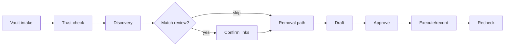

# Cleanup Templates (Presets)

Oblivion routes every case through one of seven **presets** (templates). A preset defines which identifiers you must provide, which official sources the agent may use, what gets disclosed at approval time, and how long the process typically takes.

The server is authoritative: presets live in `src/domain/cleanup.ts` as `CLEANUP_PRESETS`. The UI mirrors them for selection only. Once you pick a preset, the agent follows the shared **workflow** below.

For a shorter getting-started walkthrough, see [`USER_GUIDE.md`](USER_GUIDE.md).

---

## Shared workflow (all presets)

Every preset uses the same eleven-step plan. The agent advances one step per run (or when you tap **Continue** in the UI).

| Step | Actor | What happens |
|------|-------|----------------|
| **collect-minimum-identifiers** | Vault (you) | Add a case label and the preset's required identifier categories to the **browser vault**. Only ciphertext + redacted labels reach the server. |
| **verify-trust** | Verifier | Runtime checks: pinned images, compose hash, Intel TDX quote (Phala CVM). Sensitive connectors stay **blocked** until `verifierResult: "pass"`. |
| **discover-candidates** | Scout | Find exposure candidates from approved sources (Brave search, broker catalog, official guidance URLs). |
| **confirm-matches** | You | Review each link — **Confirm** or **Not me**. Skipped automatically for some presets (see per-template notes). |
| **verify-removal-path** | Verifier | Map official removal or rights paths (Google help, DROP, GDPR ICO guidance, DMCA, etc.). |
| **draft-actions** | Draft | Prepare request text from templates (`src/domain/templates.ts`). Venice may refine drafts if configured. |
| **request-approval** | You | One or more **disclosure cards** appear. Nothing is sent until you approve with explicit confirmation. |
| **execute-approved-action** | Connector | **Record-only** by default (`OBLIVION_EXECUTOR_MODE=record-only`). Live submission only after TEE pass + approval + live executor. |
| **await-confirmation** | Connector | Track broker/service replies (timeline + follow-ups). |
| **schedule-recheck** | Scheduler | Set recheck dates (14–90 days depending on preset/broker). |
| **escalate-if-needed** | Scheduler | Prepare follow-up or escalation notes if the source does not respond. |
| **complete** | — | Cycle done; recheck later for recurrence. |

### Autonomy modes

| Mode | Behavior |
|------|----------|
| **approval-gated** (default) | One disclosure card per destination (or per confirmed listing for broker sweeps). |
| **high-autonomy** | Batch approval policy: more destinations/actions per card (caps vary by preset). Still requires explicit approve. |

### What is never automatic

- Raw identifiers leaving the browser vault without your approval.
- Live email/broker submission (`broker-opt-out-live`, `hibp-email`) without TEE attestation pass.
- Passwords, SSNs, or breach-dump searches (policy-blocked).
- Broad consent — each action binds destination, data categories, purpose, and expiry.

---

## Template reference

### 1. Remove people-search profiles

| Field | Value |
|-------|-------|
| **ID** | `people-search-cleanup` |
| **Jurisdictions** | US, EU, UK |
| **Risk** | Standard |
| **Identifiers required** | Legal name, email, city/state |
| **Typical window** | 1–21 days (broker response varies) |

**Purpose:** Find likely people-search listings, verify matches, draft per-broker opt-outs, and schedule recurrence checks.

**Connectors used:**
- `broker-registry-sweep` — catalog-based discovery (no managed plaintext).
- `people-search-guidance` — official FTC people-search guidance.
- `broker-opt-out-live` — live opt-out (**TEE + approval**; managed plaintext).
- `california-drop-guided` — cross-reference for CA residents.

**Discovery:** Brave Search (if `BRAVE_SEARCH_API_KEY` set) + broker catalog sweep. You must confirm each link before opt-out drafting.

**Approvals:** One **broker opt-out** card per confirmed listing (destination = broker). Discloses legal name, email, city/state per broker policy.

**Execution:** Record-only by default. Live broker submission requires attestation pass + `OBLIVION_EXECUTOR_MODE=live`.

**Follow-up:** Per-broker recheck from catalog (`recheckDays`, often 14).

---

### 2. Suppress search results

| Field | Value |
|-------|-------|
| **ID** | `search-result-suppression` |
| **Jurisdictions** | US, EU, UK |
| **Risk** | Standard |
| **Identifiers required** | Legal name, email |
| **Typical window** | Hours to several days after Google review |

**Purpose:** Separate **source-page deletion** from **search result suppression** and prepare the official Google removal flow.

**Connectors used:**
- `google-removal-plan` — maps [Google's removal help](https://support.google.com/websearch/answer/12719076). **User handoff** for logged-in submission.

**Discovery:** Skips match review — scout maps the official path immediately.

**Approvals:** One **search-result-removal** card (destination: Google Search removal flow). Discloses legal name, email.

**Execution:** Guidance + record only. You complete Google's form in your own browser session.

**Follow-up:** Recheck ~7 days.

---

### 3. Use California DROP

| Field | Value |
|-------|-------|
| **ID** | `california-drop` |
| **Jurisdictions** | US only (California residency) |
| **Risk** | Standard |
| **Identifiers required** | Legal name, email, address |
| **Typical window** | Submit now; brokers process on official ~90-day schedule |

**Purpose:** Prepare the California resident flow for the [Delete Request and Opt-out Platform (DROP)](https://privacy.ca.gov/drop/).

**Connectors used:**
- `california-drop-guided` — official handoff; **user-held submission**.

**Discovery:** Skips match review.

**Approvals:** **Follow-up** card (destination: California DROP). Discloses legal name, email, address for your DROP submission.

**Execution:** Oblivion guides and tracks; **you** complete the government portal.

**Follow-up:** 90-day broker processing window.

---

### 4. Send GDPR/UK erasure request

| Field | Value |
|-------|-------|
| **ID** | `gdpr-erasure` |
| **Jurisdictions** | EU, UK |
| **Risk** | Standard |
| **Identifiers required** | Legal name, email |
| **Typical window** | Usually one month (legal exemptions/extensions possible) |

**Purpose:** Prepare controller erasure requests, deadline tracking, and escalation notes under GDPR or UK GDPR.

**Connectors used:**
- `gdpr-template` — drafts erasure request text.
- `google-removal-plan` — supplementary search suppression guidance if needed.

**Discovery:** Skips match review.

**Approvals:** **GDPR erasure** or **UK GDPR erasure** card (destination: named data controller). Discloses legal name, email.

**Draft template:** `gdpr-uk-erasure-request.md` via `buildDraftText`.

**Follow-up:** Escalation draft to regulator if no lawful response (~30 days).

---

### 5. Check breach exposure

| Field | Value |
|-------|-------|
| **ID** | `breach-exposure` |
| **Jurisdictions** | US, EU, UK |
| **Risk** | Standard |
| **Identifiers required** | Email |
| **Typical window** | Immediate for configured checks |

**Purpose:** Mitigation-only breach checks — **no breach dump search**.

**Connectors used:**
- `hibp-email` — Have I Been Pwned email check (**TEE + approval**; managed plaintext; needs `HIBP_API_KEY` for live).
- `hibp-password-range` — Pwned Passwords **SHA-1 prefix only** (never full password on server).

**Discovery:** Skips match review.

**Approvals:** Two cards typical:
1. **HIBP email check** — discloses email to HIBP if approved.
2. **Pwned password range check** — no identifier disclosure (prefix-only k-anonymity).

**Execution:** Email check blocked until attestation pass. Password range check allowed in local/record-only mode.

**Follow-up:** Immediate mitigation checklist in timeline.

---

### 6. High-risk safety cleanup

| Field | Value |
|-------|-------|
| **ID** | `high-risk-safety` |
| **Jurisdictions** | US, EU, UK |
| **Risk** | **High-risk safety** |
| **Identifiers required** | Legal name, address, relative |
| **Typical window** | Triage immediately; source response varies |

**Purpose:** Prioritize current address, relatives, minors, work/school exposure, and rapid source-page removals.

**Connectors used:** Same family as people-search (`broker-registry-sweep`, `people-search-guidance`, `broker-opt-out-live`, `google-removal-plan`, `gdpr-template`).

**Discovery:** Broker sweep + guidance; uncertain matches flagged for **local confirmation** before drafting.

**Approvals:** Per confirmed high-risk source (batch limits: 10 destinations / 10 actions in high-autonomy).

**Policy emphasis:** Avoid repeating current address in drafts; prioritize source removal over suppression.

**Follow-up:** Shorter recheck (3 days) when scout marks high-risk.

---

### 7. Takedown copied content

| Field | Value |
|-------|-------|
| **ID** | `content-takedown` |
| **Jurisdictions** | US, EU, UK |
| **Risk** | Standard |
| **Identifiers required** | Legal name, email, infringing URL, original work reference |
| **Typical window** | Hours to several weeks (host response) |

**Purpose:** Identify infringing URLs, draft DMCA or platform abuse notices, pause for approval before any host contact.

**Connectors used:**
- `dmca-notice-drafter` — statutory notice draft (**user handoff**).
- `platform-abuse-handoff` — official abuse/copyright paths.
- `platform-abuse-live` — live abuse notice (**TEE + approval**).

**Discovery:** Content URL discovery; you confirm each infringing link.

**Approvals:** Per confirmed URL — typically **DMCA takedown** + **platform abuse report** cards. Discloses legal name, email, infringing URL, work reference.

**Draft templates:** `dmca-takedown-notice.md`, `platform-abuse-report.md`.

**Follow-up:** ~7–14 days; counter-notice review notes if needed.

---

## Action types and draft templates

When the agent drafts an approval card, it picks an **action type** and template:

| Action type | Template file | Used by presets |
|-------------|---------------|-----------------|
| `broker-opt-out` | `broker-opt-out-request.md` | people-search, high-risk |
| `search-result-removal` | `search-result-removal-note` | search suppression |
| `gdpr-erasure` / `uk-gdpr-erasure` | `gdpr-uk-erasure-request.md` | GDPR |
| `hibp-email-check` | `hibp-email-check-approval` | breach exposure |
| `pwned-password-range-check` | (inline guidance) | breach exposure |
| `follow-up` | `follow-up-request.md` | DROP, rechecks |
| `dmca-takedown` | `dmca-takedown-notice.md` | content takedown |
| `platform-abuse-report` | `platform-abuse-report.md` | content takedown |
| `escalation-draft` | `escalation-notes.md` | GDPR escalation |

Draft body text is built server-side in `buildDraftText` — redacted purpose and destination only on the wire.

---

## Choosing a template

| If you want to… | Pick |
|-----------------|------|
| Remove Spokeo-style listings | **Remove people-search profiles** |
| Hide a Google result after the source is gone | **Suppress search results** |
| Exercise California DROP rights | **Use California DROP** (US + CA residency) |
| Request erasure from a company in EU/UK | **Send GDPR/UK erasure request** |
| See if an email appeared in known breaches | **Check breach exposure** |
| Urgent address/relative exposure | **High-risk safety cleanup** |
| Remove copied photos, writing, or media | **Takedown copied content** |

---

## Record-only vs live execution

| Executor mode | What you get |
|---------------|--------------|
| `record-only` (default) | Approved actions logged with handoff instructions. You submit via official portals/forms. |
| `live` | Approved connectors may transmit approval-bound data from the TEE. Still gated by policy + per-action approval. |

Sensitive connectors (`requiresManagedPlaintext: true`):

- `hibp-email`
- `broker-opt-out-live`
- `platform-abuse-live`

These require `GET /api/trust/attestation` → `verifierResult: "pass"` before execution.

---

## API: list presets

`GET /api/presets` returns the same metadata the UI uses (title, summary, jurisdictions, required identifiers, connectors, expected window). Case-specific availability also depends on jurisdiction set at case creation.

---

## Related docs

- [`USER_GUIDE.md`](USER_GUIDE.md) — UI walkthrough
- [`SECURITY.md`](../SECURITY.md) — trust model and production requirements
- [`AGENTS.md`](../AGENTS.md) — maintainer invariants and how to add presets safely