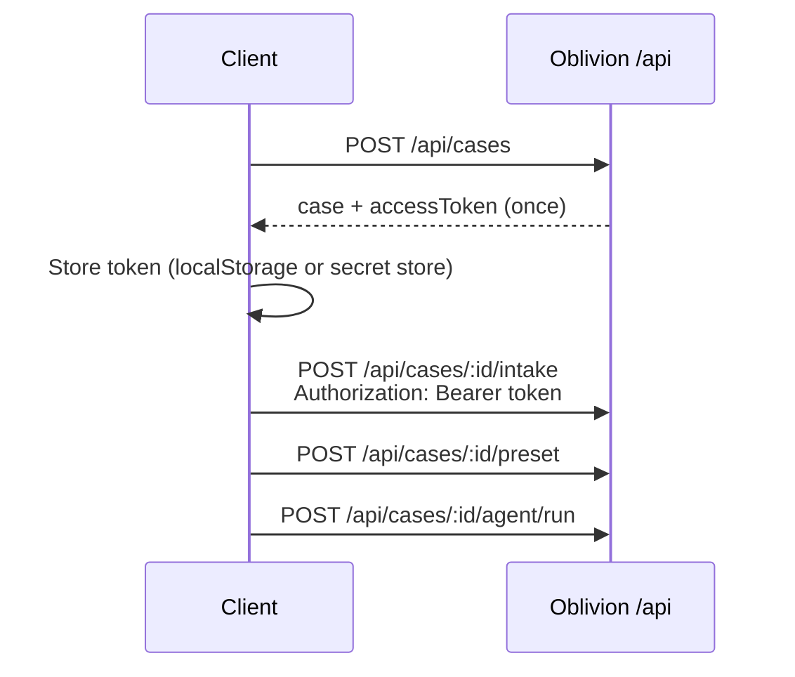

# Consumer API

The Oblivion browser app and self-hosted integrations use `/api/*` with **case access tokens** — no user accounts.



---

## Create a case

```sh
curl -sS -X POST http://localhost:8080/api/cases \
  -H "Content-Type: application/json" \
  -d '{"jurisdiction":"US","authorityBasis":"self","riskLevel":"standard"}'
```

Response includes `accessToken` **once**. Store it immediately; the server keeps only `accessTokenHash`.

---

## Authenticated requests

Send the token on every case-scoped route:

```sh
TOKEN="..." # from create response
CASE_ID="case_..."

curl -sS -H "Authorization: Bearer $TOKEN" \
  "http://localhost:8080/api/cases/$CASE_ID"

curl -sS -X POST -H "Authorization: Bearer $TOKEN" \
  -H "Content-Type: application/json" \
  -d '{"encryptedIntake":{...},"redactedScope":{...}}' \
  "http://localhost:8080/api/cases/$CASE_ID/intake"
```

The Oblivion browser app attaches the header automatically when a token exists for the case id in the path or JSON body.

---

## Public routes (no case token)

- `POST /api/cases` — create
- `GET /api/presets`, `GET /api/health`, `GET /api/config`
- `GET /api/trust/*`, `GET /api/integrations/*`
- Wallet / x402 catalog endpoints that do not target a specific case

`GET /api/cases` returns `401 case-list-not-available`. The UI keeps case summaries in `localStorage` and refreshes individual cases with tokens.

---

## Partner cases

Cases created via `/v1/cases` carry `partnerId`. They **cannot** be accessed on `/api/*` (`403 partner-case-use-v1-api`). Use the [Partner API](/docs/developers/partner-api) with your API key.

---

## Security notes

- Treat `caseId` + `accessToken` as a single capability credential.
- Never log tokens or put them in query strings.
- Export and delete require the same token (`assertCaseExportAllowed`).
- Hackathon demo routes (`/api/hackathon/*`) require `HACKATHON_MODE=true` on the server.

Full model: [SECURITY.md](https://github.com/thomasjvu/oblivion/blob/main/SECURITY.md#consumer-api-authentication) in the open-source repo.