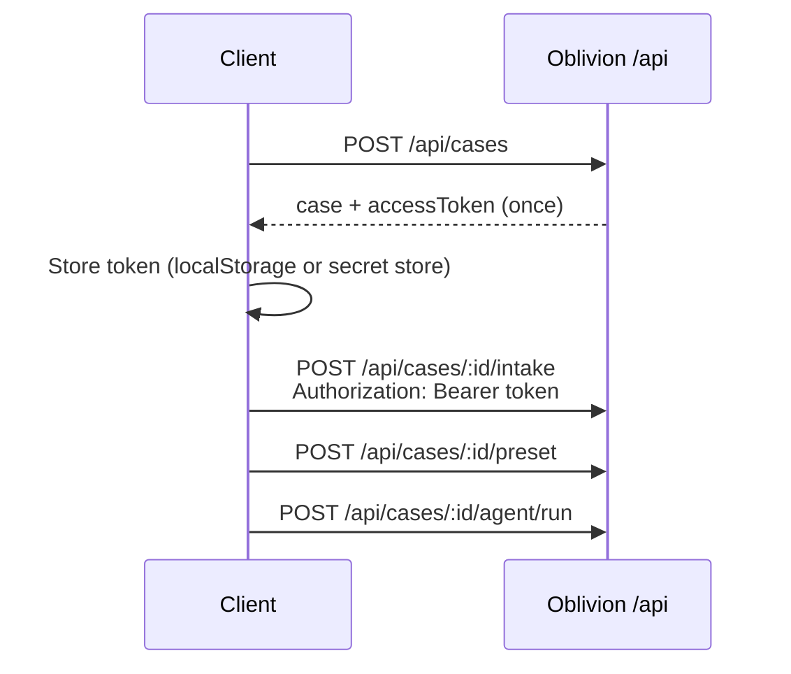

# Consumer API

The Oblivion browser app and self-hosted integrations use `/api/*` with **case access tokens** — no user accounts.



---

## Create a case

```sh
curl -sS -X POST http://localhost:8080/api/cases \
  -H "Content-Type: application/json" \
  -d '{"jurisdiction":"US","authorityBasis":"self","riskLevel":"standard"}'
```

Response includes `accessToken` **once**. Store it immediately; the server keeps only `accessTokenHash`.

---

## Authenticated requests

Send the token on every case-scoped route:

```sh
TOKEN="..." # from create response
CASE_ID="case_..."

curl -sS -H "Authorization: Bearer $TOKEN" \
  "http://localhost:8080/api/cases/$CASE_ID"

curl -sS -X POST -H "Authorization: Bearer $TOKEN" \
  -H "Content-Type: application/json" \
  -d '{"encryptedIntake":{...},"redactedScope":{...}}' \
  "http://localhost:8080/api/cases/$CASE_ID/intake"
```

The Oblivion browser app attaches the header automatically when a token exists for the case id in the path or JSON body.

---

## Public routes (no case token)

- `POST /api/cases` — create
- `POST /api/discovery/preview` — limited broker preview (rate-limited by IP/wallet; no case created)
- `GET /api/brokers` — read-only people-search broker catalog (hosts, opt-out URLs, sweep priority)
- `GET /api/presets`, `GET /api/health`, `GET /api/config`
- `GET /api/trust/*`, `GET /api/integrations/*`
- Wallet / x402 catalog endpoints that do not target a specific case

`GET /api/cases` returns `401 case-list-not-available`. The UI keeps case summaries in `localStorage` and refreshes individual cases with tokens.

---

## Wallet case index (no token re-issue)

After a case is activated, link it to the paying wallet for cross-device lookup of **case IDs** (redacted labels only):

```sh
# List cases paid/linked to a wallet (no access tokens returned)
curl -sS "http://localhost:8080/api/wallet/cases?walletAddress=0x..."

# Link case to wallet (requires case Bearer token + wallet address)
curl -sS -X POST http://localhost:8080/api/wallet/cases/link \
  -H "Authorization: Bearer $TOKEN" \
  -H "Content-Type: application/json" \
  -d '{"caseId":"case_...","walletAddress":"0x..."}'
```

Users still import `caseId` + `accessToken` from a client-side **recovery kit** — the server never re-issues tokens.

---

## Discovery preview vs full discover

| Route | Auth | Behavior |
|-------|------|----------|
| `POST /api/discovery/preview` | None | Heuristic broker sweep only; daily cap (default 5 previews per IP/wallet per day in production; operator-configurable) |
| `POST /api/cases/:id/findings/discover` | Bearer + activation | Venice-scored discovery; debits discovery credits (default 15) from wallet |

Full discover accepts optional fields in the JSON body:

- `walletAddress` — subscription auto-activation and credit debit
- `pastedUrls` — profile URLs to import and score
- `searchLabels` — ephemeral `{ personLabel, aliases?, regionLabel? }` for this request only (not stored on the case). Use full name + city here; keep `redactedScope.personLabel` as initials on intake.

The response `discoveryPlan.searchMode` is `ephemeral` when `searchLabels` were used, or `redacted` when only stored scope labels apply.

---

## Partner cases

Cases created via `/v1/cases` carry `partnerId`. They **cannot** be accessed on `/api/*` (`403 partner-case-use-v1-api`). Use the [Partner API](/docs/developers/partner-api) with your API key.

---

## Security notes

- Treat `caseId` + `accessToken` as a single capability credential.
- Never log tokens or put them in query strings.
- Export and delete require the same token (`assertCaseExportAllowed`).
- Hackathon demo routes (`/api/hackathon/*`) require `HACKATHON_MODE=true` on the server.

Full model: [SECURITY.md](https://github.com/thomasjvu/oblivion/blob/main/SECURITY.md#consumer-api-authentication) in the open-source repo.