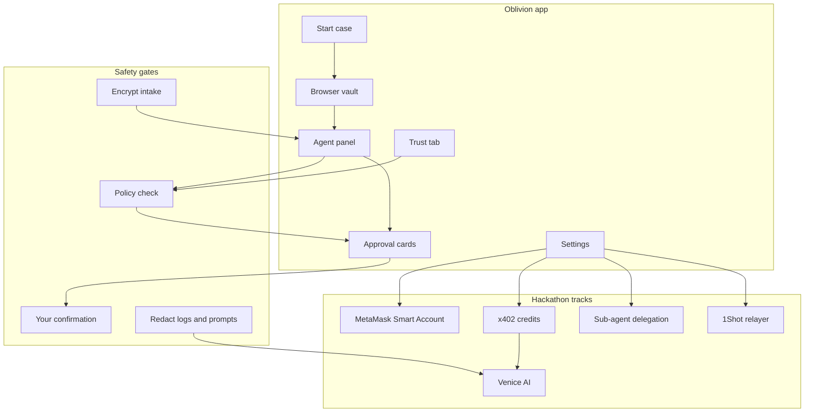
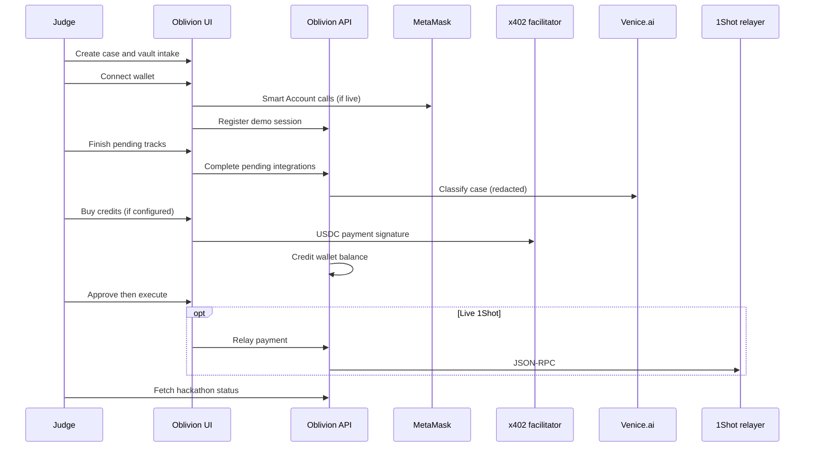

# Hackathon Demo

**3-minute judge walkthrough** for private identity cleanup: encrypted intake, explicit approvals, and crypto-native payment rails. Every integration demo runs behind the same safety gates — no checklist bypass.

Checklist status: **Settings → Developer details** or `GET /api/hackathon/status?caseId=...` (requires `HACKATHON_MODE=true` on the server — off by default in production)

---

## 3-minute script

| Time | Show |
|------|------|
| 0:00–0:30 | Problem + encrypted vault intake |
| 0:30–1:00 | Connect MetaMask Smart Account |
| 1:00–1:20 | Finish pending tracks (developer checklist) |
| 1:20–1:45 | Buy credits via x402 (if configured) |
| 1:45–2:05 | Approval gate — read disclosure, confirm |
| 2:05–2:25 | Execute (practice run or live) |
| 2:25–2:45 | Venice AI + sub-agent delegation |
| 2:45–2:55 | 1Shot relay (if live) |
| 2:55–3:00 | Trust tab — attestation and safety invariants |

---

## Judge flow

---

## Track matrix

| Track | Where to start | Demo mode | Live mode |
|-------|----------------|-----------|-----------|
| **Best Agent** | Presets + agent panel | Always works | Practice-run execution |
| **MetaMask** | Connect wallet | Demo grants shown | Smart Account live calls |
| **x402 credits** | Settings → Payment rails | Authorized session | Real USDC settlement |
| **ERC-7710** | Payment rails permission | Demo delegation | Scoped live permission |
| **Venice AI** | Agent chat / classify | Blocked without API key | Needs credits + key |
| **A2A delegation** | Settings → delegate | In-memory scoped grants | Same API path |
| **1Shot relay** | Settings → relay | Finish-pending events | Live JSON-RPC relay |

---

## What to say about safety

- **Demo data only** — use synthetic identity; never real SSNs or passwords in prompts or logs
- **Local dev trust** — attestation shows not-configured until production trust center; sensitive live connectors are blocked by design
- **Delegation** — scoped in-app grants for the demo, not a full external agent wire protocol
- **Credits** — Starter pack (500 credits) and Monitor (1,200/month) fund Venice; approvals still required for every send

---

## Live tracks (operators)

If you are hosting the demo with live integrations, configure API keys and payment rails per the repo [README](https://github.com/thomasjvu/oblivion/blob/main/README.md). Set `HACKATHON_MODE=true` on the API host to expose `/api/hackathon/*`. Poll `GET /api/integrations/status` and `GET /api/hackathon/status?caseId=...` (with case access token) to verify readiness.

[Open Oblivion](https://oblivion.phantasy.bot)