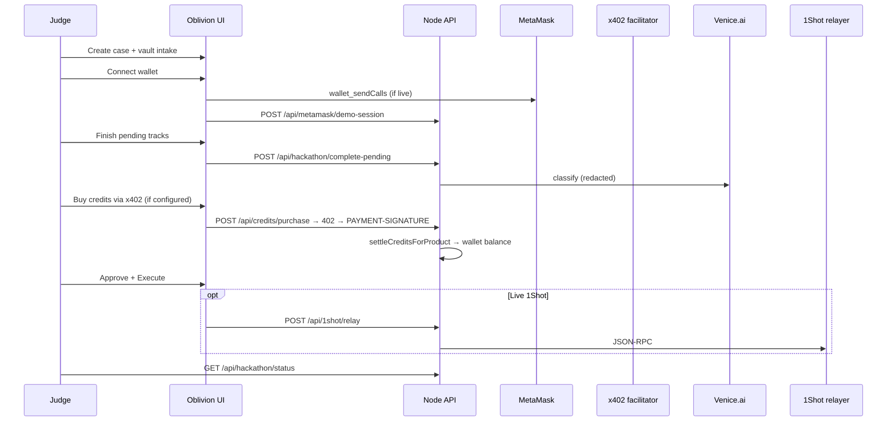

# Hackathon Demo

Private identity cleanup: encrypted intake, explicit approvals, crypto-native permissions. **Every adapter runs behind the same gates** — vault, propose → approve → execute, redaction, attestation. No checklist bypass.

```mermaid
flowchart TB
  subgraph UI["Browser UI"]
    Landing[Landing + presets]
    Wallet[Connect wallet / Smart Account]
    Agent[Agent dock + autopilot]
    Approvals[Approval cards]
    Settings[Settings → Developer details]
    Trust[Trust tab]
  end

  subgraph Gates["Safety gates (always on)"]
    Vault[Browser vault — AES-GCM intake]
    Policy[policy.ts evaluateProposedAction]
    Approve[Explicit userConfirmation]
    Redact[redactText + sanitizeForLog]
    TEE[assertSensitiveExecutionAllowed + Phala quote]
  end

  subgraph Core["Core agent (Best Agent track)"]
    Plan[AgentPlan + CLEANUP_PRESETS]
    Orch[orchestration.ts runCleanupAgentStep]
    Exec[executor.ts executeApprovedAction]
    Conn[connectorRuntime.ts live connectors]
  end

  subgraph MM["MetaMask Smart Accounts"]
    MMClient[metamaskSmartAccount.js wallet_sendCalls]
    MMServer["/api/metamask/demo-session"]
    E7702[EIP-7702 authorization grant]
    E7715[ERC-7715 advanced permission]
  end

  subgraph Pay["x402 + ERC-7710"]
    X402Prep["/api/credits/purchase | monitor"]
    X402Pay["x402Pay.js PAYMENT-SIGNATURE"]
    Credits[Wallet credit balance]
    E7710[ERC-7710 delegation + PaymentAgent scope]
  end

  subgraph Venice["Venice AI"]
    VClassify["/api/ai/classify-case"]
    VDraft["/api/ai/draft-request"]
    VReview["/api/ai/review-approval"]
    VChat["/api/agent/chat"]
    VRedact[Redacted prompts only]
  end

  subgraph A2A["A2A redelegation"]
    Delegate["/api/agents/delegate"]
    Scout[ScoutAgent]
    Draft[DraftAgent]
    Verifier[VerifierAgent]
    Payment[PaymentAgent]
  end

  subgraph Shot["1Shot relayer"]
    Relay["/api/1shot/relay"]
    Webhook["/api/1shot/webhook"]
    RelayerEvents[Relayer timeline + table]
  end

  Landing --> Agent
  Agent --> Plan --> Orch
  Orch --> Approvals
  Approvals --> Policy --> Approve --> Exec
  Exec --> TEE --> Conn

  Vault --> Orch
  Redact --> Venice
  Redact --> Conn

  Wallet --> MMClient --> MMServer --> E7702 --> E7715
  Settings --> X402Prep --> E7710
  Settings --> X402Prep --> X402Pay --> Credits --> E7710

  Agent --> VClassify
  Agent --> VDraft
  Agent --> VReview
  Agent --> VChat
  VClassify --> VRedact
  VDraft --> VRedact
  VReview --> VRedact
  VChat --> VRedact
  Credits --> VChat

  Settings --> Delegate --> Scout & Draft & Verifier & Payment
  Settings --> Relay --> RelayerEvents
  Relay --> Webhook

  Trust --> TEE
```

`GET /api/integrations/status` for live JSON snapshot.

---

## Track matrix

| Track | Entry | Live when | Demo fallback |
|-------|-------|-----------|---------------|
| **Best Agent** | Presets, agent dock | Always | `record-only` executor |
| **MetaMask** | Connect + Smart Account | `WALLET_LIVE_MODE=true` | Demo EIP-7702/7715 grants |
| **x402 credits** | Payment rails | `X402_PAY_TO` + facilitator | `authorized` session without settlement |
| **ERC-7710** | Scoped payment permission | Same as x402 | Demo delegation objects |
| **Venice AI** | Classify / Draft / Chat | `VENICE_API_KEY` + wallet credits | 503 without key; 402 without credits |
| **A2A** | Delegate sub-agents | `/api/agents/delegate` | In-memory scoped grants |
| **1Shot** | Relay payment | `ONESHOT_API_KEY` | Finish-pending events |

---

## Judge flow



---

## 3-minute script

| Time | Show |
|------|------|
| 0:00–0:30 | Problem + encrypted intake |
| 0:30–1:00 | MetaMask Smart Account |
| 1:00–1:20 | Finish pending tracks (checklist) |
| 1:20–1:45 | x402 pay (if configured) |
| 1:45–2:05 | Approval gate |
| 2:05–2:25 | Execute (record or live) |
| 2:25–2:45 | Venice + A2A delegation |
| 2:45–2:55 | 1Shot relay |
| 2:55–3:00 | Trust tab / TEE invariant |

---

## Environment (live tracks)

```sh
VENICE_API_KEY=...
X402_PAY_TO=0x...
X402_FACILITATOR_URL=https://x402.org/facilitator
WALLET_LIVE_MODE=true
ONESHOT_API_KEY=...
OBLIVION_EXECUTOR_MODE=live
PHALA_ATTESTATION_URL=...
```

**Probes:**

```sh
curl -s localhost:8080/api/integrations/status | jq
curl -s localhost:8080/api/x402/config | jq
curl -s "localhost:8080/api/hackathon/status?caseId=CASE_ID" | jq
```

**Tests:** `npm test -- test/api/hackathon.test.ts test/domain/hackathon.test.ts`

---

## Key routes

| Route | Purpose |
|-------|---------|
| `GET /api/integrations/status` | `liveReady.*` flags |
| `POST /api/metamask/demo-session` | EIP-7702 + ERC-7715 |
| `GET /api/credits/catalog` | Products + debit rates |
| `POST /api/credits/purchase` \| `monitor` | x402 → wallet credits |
| `GET /api/credits/balance` | Wallet credit balance |
| `POST /api/ai/classify-case` \| `draft-request` \| `review-approval` | Venice (redacted) |
| `POST /api/agent/chat` | Venice chat (credit-metered) |
| `POST /api/agents/delegate` | A2A set |
| `POST /api/1shot/relay` | Live relayer |
| `POST /api/hackathon/complete-pending` | Batch-complete tracks |
| `GET /api/hackathon/status?caseId=` | Checklist booleans |

---

## Safety + honesty

- **Demo data only** — synthetic identity; no real SSNs/passwords in logs or Venice prompts
- **Phala in local dev** — `verifierResult: not-configured` until prod trust center; sensitive connectors **blocked by design**
- **A2A** — in-domain scoped grants, not external wire protocol
- **x402** — settlement credits the wallet (`credit-starter` 500, `credit-monitor` 1200/mo); Venice debits per token use