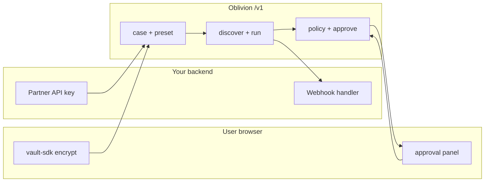

# Partner API

Embed broker cleanup **without becoming a data custodian**. Raw identifiers stay in the **user's browser vault** (AES-256-GCM). Your servers get `caseId`, redacted labels, exposure URLs, and webhooks.



[Onboarding runbook](/docs/developers/partner-onboarding) · OpenAPI: [`openapi-v1.yaml`](openapi-v1.yaml)

**Consumer vs partner billing:** End users buy **wallet credits** via x402 ([Pricing](/docs/pricing)). Partners use a **separate API-key credit pool** metered per case/discovery/execute/AI — no user wallet required.

---

## Quick start

```sh
OBLIVION_PARTNER_KEYS=acme:obl_live_your_secret_key
```

1. `POST /v1/cases` — jurisdiction, `externalRef`
2. **Browser:** `@oblivion/vault-sdk` → encrypt intake → `POST /v1/cases/:id/intake`
3. `POST /v1/cases/:id/preset` → `/discover` → `/run`
4. Surface approval cards — user types `userConfirmation` (≥8 chars). **API key cannot approve.**

Demo: `examples/partner-demo/index.html`

---

## Trust boundaries

| Layer | Partner sees | User vault |
|-------|----------------|------------|
| Create | `caseId`, `externalRef` | — |
| Intake | `encryptedIntake` + `redactedScope` | Key never leaves browser |
| Discovery | URLs, scores, redacted snippets | — |
| Approve | Destination, categories, purpose | User confirms |
| Execute | Status, `recorded` / `live` | Browser handoff after approve |

`GET /v1/trust/attestation` — no auth required.

---

## Presets (v1)

- `people-search-cleanup` — broker discovery + opt-out
- `breach-exposure` — HIBP email + password range (prefix-only)

Live broker submission needs TEE `pass` + user approval.

---

## Widgets (`@oblivion/partner-ui`)

| Widget | Purpose |
|--------|---------|
| `OblivionApprovalPanel` | Disclosure cards + user confirmation |
| `OblivionStatusPanel` | Phase, pending approvals, recheck |
| `OblivionStatusBadge` | TEE / local runtime indicator |

**Sandbox:** `OBLIVION_PARTNER_SANDBOX_KEYS` → `environment: "sandbox"` in `GET /v1/partners/me`

**Rotate:** `POST /v1/partners/me/rotate-key` — new key returned once.

---

## Core endpoints

| Method | Path | Purpose |
|--------|------|---------|
| `POST` | `/v1/cases` | Create (idempotent on `externalRef`) |
| `POST` | `/v1/cases/:id/intake` | Encrypted intake (browser) |
| `POST` | `/v1/cases/:id/preset` | Start preset |
| `POST` | `/v1/cases/:id/discover` | Exposure discovery |
| `POST` | `/v1/cases/:id/run` | One agent step |
| `POST` | `/v1/cases/:id/run-until-blocked` | Until approval/blocked/complete |
| `POST` | `/v1/approvals/:id/approve` | User confirmation required |
| `POST` | `/v1/actions/:id/execute` | After approve |
| `POST` | `/v1/webhooks` | Register webhook |
| `POST` | `/v1/webhooks/register-inbox` | Dev inbox (no external server) |
| `GET` | `/v1/cases/:id/status` | Phase + pending |
| `GET` | `/v1/cases/:id/export` | Redacted export (audited) |
| `DELETE` | `/v1/cases/:id` | Purge case |
| `GET` | `/v1/partners/me/usage` | Metering |
| `POST` | `/v1/billing/invoices/close` | Close period invoice |

---

## Webhooks

HMAC-SHA256: `X-Oblivion-Signature` over `{timestamp}.{body}`.

Events: `case.created` · `exposure.discovered` · `approval.pending` · `approval.approved` · `action.executed` · `recheck.due` · `case.completed` · `case.deleted`

Retries: `GET /v1/webhooks/deliveries?status=failed` · `POST .../retry`

---

## Billing (credit pool)

| Meter | Default credits |
|-------|-----------------|
| Case create | 10 |
| Discovery | 5 |
| Execute | 15 |
| AI (Venice) | 2 / 100 tokens (min 2) |

---

## Never do

- Decrypt `encryptedIntake` server-side
- Approve with partner API key only
- Auto-approve or bypass gates
- Send raw PII to your LLM/analytics

```sh
npm install @oblivion/partner-sdk @oblivion/vault-sdk
```

[Open Oblivion](https://oblivion.phantasy.bot)