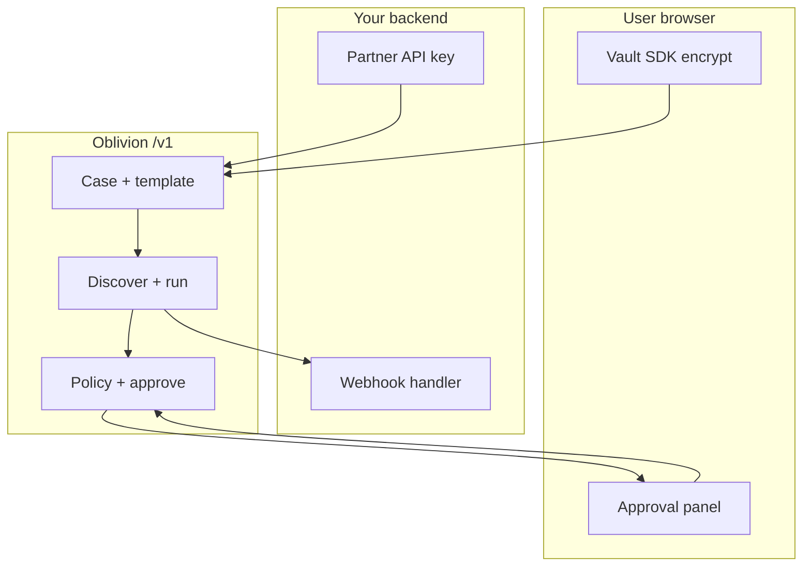

# Partner API

Embed broker cleanup **without becoming a data custodian**. Raw identifiers stay in the **user's browser vault** (AES-256-GCM). Your servers get `caseId`, redacted labels, exposure URLs, and webhooks.



[Onboarding runbook](/docs/developers/partner-onboarding) · [API reference](/docs/developers/api-reference) · [`openapi-v1.yaml`](/openapi-v1.yaml) · [Open in Swagger Editor](https://editor.swagger.io/?url=https://oblivion-docs.pages.dev/openapi-v1.yaml)

**Consumer vs partner billing:** End users buy **wallet credits** via x402 ([Pricing](/docs/pricing)). Partners use a **separate API-key credit pool** metered per case, discovery, execute, and AI — no user wallet required.

---

## Quick start

Configure partner API keys when you deploy Oblivion ([README](https://github.com/thomasjvu/oblivion/blob/main/README.md)). Use sandbox keys for development.

1. `POST /v1/cases` — jurisdiction, `externalRef`
2. **Browser:** `@oblivion/vault-sdk` → encrypt intake → `POST /v1/cases/:id/intake`
3. `POST /v1/cases/:id/preset` → `/discover` → `/run`
4. Surface approval cards — user types confirmation (≥8 chars). **API key cannot approve.**

Demo: `examples/partner-demo/index.html`

```sh
curl -sS -H "Authorization: Bearer obl_live_..." http://localhost:8080/v1/partners/me
```

---

## Trust boundaries

| Layer | Partner sees | User vault |
|-------|----------------|------------|
| Create | `caseId`, `externalRef` | — |
| Intake | `encryptedIntake` + `redactedScope` | Key never leaves browser |
| Discovery | URLs, scores, redacted snippets | — |
| Approve | Destination, categories, purpose | User confirms |
| Execute | Status, recorded or live | Browser handoff after approve |

`GET /v1/trust/attestation` — no auth required.

**Route isolation:** Partner cases (`partnerId` set) must use `/v1/*` with your API key. Consumer `/api/*` returns `403 partner-case-use-v1-api` even if `caseId` is known. End-user browser sessions use [case access tokens](/docs/developers/consumer-api) on `/api/*` — distinct from partner keys.

---

## Templates (v1)

Default partner presets (`GET /v1/presets`):

- `people-search-cleanup` — broker discovery + opt-out
- `breach-exposure` — breach email check + password range (prefix-only)
- `search-result-suppression` — search-result removal workflows
- `california-drop` — California broker opt-out rights
- `gdpr-erasure` — GDPR erasure requests

Consumer-only presets (not on partner allowlist by default): `high-risk-safety`, `content-takedown`.

Server operators can narrow or expand the partner preset allowlist via deployment configuration (see operator runbooks).

Live broker submission needs production trust verification and user approval.

---

## Widgets (`@oblivion/partner-ui`)

| Widget | Purpose |
|--------|---------|
| `OblivionApprovalPanel` | Disclosure cards + user confirmation |
| `OblivionStatusPanel` | Phase, pending approvals, recheck |
| `OblivionStatusBadge` | Trust / runtime indicator |

**Sandbox:** use sandbox-issued keys; `GET /v1/partners/me` returns `environment: "sandbox"`.

**Rotate:** `POST /v1/partners/me/rotate-key` — new key returned once.

---

## Core endpoints

| Method | Path | Purpose |
|--------|------|---------|
| `POST` | `/v1/cases` | Create (idempotent on `externalRef`) |
| `POST` | `/v1/cases/:id/intake` | Encrypted intake (browser) |
| `POST` | `/v1/cases/:id/preset` | Start template |
| `POST` | `/v1/cases/:id/discover` | Exposure discovery |
| `POST` | `/v1/cases/:id/run` | One agent step |
| `POST` | `/v1/cases/:id/run-until-blocked` | Until approval/blocked/complete |
| `POST` | `/v1/approvals/:id/approve` | User confirmation required |
| `POST` | `/v1/actions/:id/execute` | After approve |
| `POST` | `/v1/webhooks` | Register webhook |
| `POST` | `/v1/webhooks/register-inbox` | Dev inbox (no external server) |
| `GET` | `/v1/cases/:id/status` | Phase + pending |
| `GET` | `/v1/cases/:id/export` | Redacted export (audited) |
| `DELETE` | `/v1/cases/:id` | Purge case |
| `GET` | `/v1/partners/me/usage` | Metering |
| `POST` | `/v1/billing/invoices/close` | Close period invoice |

Full request/response shapes: [OpenAPI v1](/openapi-v1.yaml)

---

## Webhooks

HMAC-SHA256: `X-Oblivion-Signature` over `{timestamp}.{body}`.

Events: `case.created` · `exposure.discovered` · `approval.pending` · `approval.approved` · `action.executed` · `recheck.due` · `case.completed` · `case.deleted`

Retries: `GET /v1/webhooks/deliveries?status=failed` · `POST .../retry`

---

## Never do

- Decrypt `encryptedIntake` server-side
- Approve with partner API key only
- Auto-approve or bypass gates
- Send raw PII to your LLM or analytics

```sh
npm install @oblivion/partner-sdk @oblivion/vault-sdk
```

[Open Oblivion](https://oblivion.phantasy.bot)