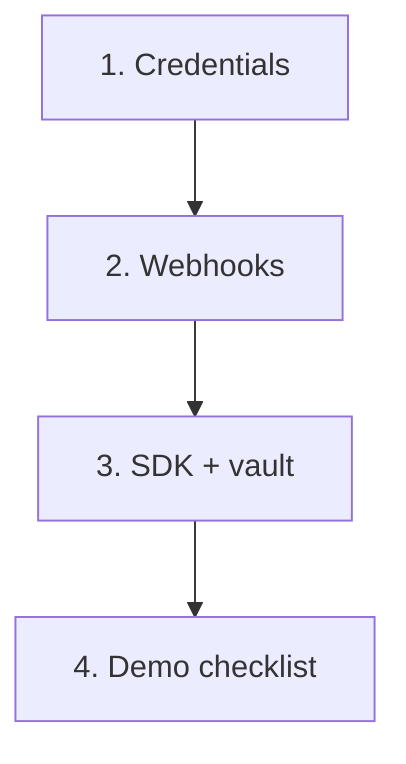

# Partner Onboarding

30-minute path to a working people-search integration.



**Prerequisites:** Oblivion API (local or hosted) · HTTPS webhook URL (or dev inbox) · browser page for vault + approvals

---

## 1. Credentials (5 min)

Issue partner API keys when you deploy Oblivion ([README](https://github.com/thomasjvu/oblivion/blob/main/README.md)). Use sandbox keys for local development.

```sh
curl -s http://localhost:8080/v1/partners/me -H "Authorization: Bearer obl_live_..."
```

## 2. Webhooks (5 min)

**Local:** `POST /v1/webhooks/register-inbox` — deliveries at `GET /v1/partners/me/webhook-inbox`

**Production:** `POST /v1/webhooks` with `url` + `secret` — verify with `@oblivion/partner-sdk/webhooks`

Events: `case.created` · `exposure.discovered` · `approval.pending` · `approval.approved` · `action.executed` · `recheck.due` · `case.completed`

## 3. SDK (10 min)

```html
<script type="module">
  import { OblivionPartnerClient } from "/packages/partner-sdk/index.js";
  import { OblivionApprovalPanel } from "/packages/partner-ui/widgets.js";
  import { createVaultKey, encryptVaultPayload, buildEncryptedIntake } from "/packages/vault-sdk/...";

  const client = new OblivionPartnerClient({ baseUrl: "...", apiKey: "..." });
  const { case: c } = await client.createCase({ jurisdiction: "US", authorityBasis: "self", externalRef: "user_12345" });

  const vaultKey = await createVaultKey();
  const intake = await buildEncryptedIntake(vaultKey, c.id, { contactEmail: "..." }, encryptVaultPayload);
  await client.submitIntake(c.id, intake);

  await client.applyPreset(c.id, "people-search-cleanup");
  await client.runUntilBlocked(c.id);

  new OblivionApprovalPanel({ client, caseId: c.id, container: "#approvals" }).refresh();
</script>
```

Reference: [/examples/partner-demo/index.html](/examples/partner-demo/index.html)

## 4. Demo checklist (10 min)

| Step | API | You see |
|------|-----|---------|
| Create | `POST /v1/cases` | `caseId`, `externalRef` |
| Intake | `POST .../intake` | ciphertext + redacted labels |
| Preset | `POST .../preset` | `case.phase_changed` webhook |
| Discover | `POST .../discover` | exposure URLs |
| Confirm | `POST .../exposures/:id/confirm` | — |
| Run | `POST .../run-until-blocked` | `approval.pending` |
| Approve | `POST /v1/approvals/:id/approve` | `approval.approved` |
| Execute | `POST /v1/actions/:id/execute` | `action.executed` |

---

## Security checklist

- [ ] Vault key never on partner backend
- [ ] API key in secrets manager, not client bundle
- [ ] User types approval confirmation
- [ ] Webhook signatures verified
- [ ] `GET /v1/trust/runtime` matches expected mode

**Rotate:** `POST /v1/partners/me/rotate-key` · **Invoice:** `POST /v1/billing/invoices/close` with `{"period":"2026-06"}`

[Partner API](/docs/developers/partner-api) · [Open Oblivion](https://oblivion.phantasy.bot)