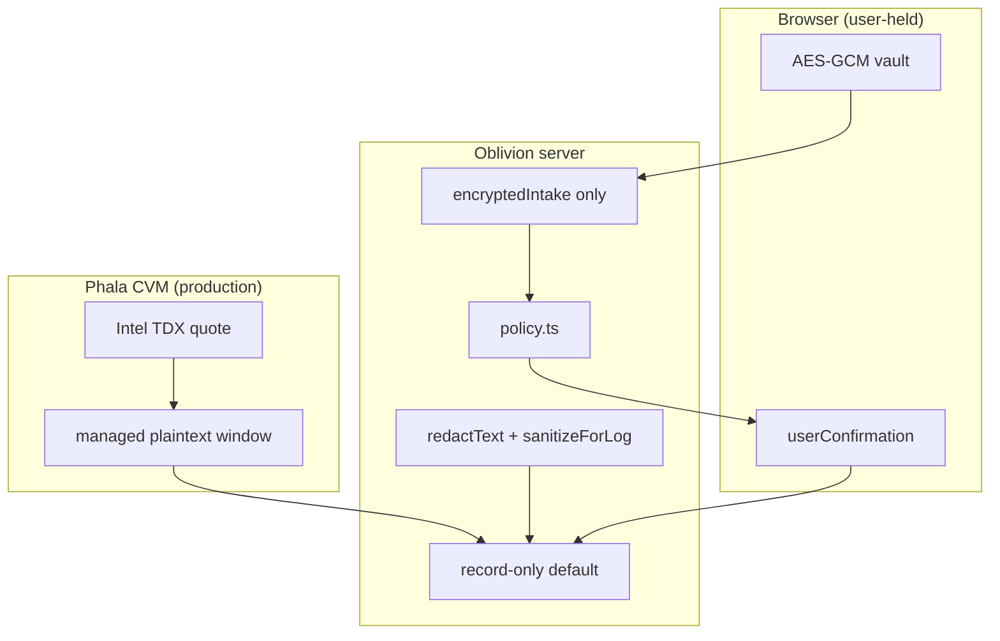

# Security Model

Oblivion minimizes trust surface area. Third-party services (brokers, search engines, HIBP) may receive identifiers **only after you approve** a specific action.

---

## Managed Oblivion

| Control | What it does |
|---------|----------------|
| Client vault | Raw identifiers encrypted before persistence |
| Server storage | Ciphertext + minimal redacted metadata |
| Policy | Blocks actions before LLM/tool use |
| Phala CVM | Production deployment target |
| Trust Center | Attestation, compose hash, image digests, source commit |
| Runtime guard | Sensitive connectors blocked unless TEE pass |
| Record-only default | Live connectors behind approval gates |

## Installable skill

`skills/clean-online-identity/SKILL.md` is a portable workflow for other agents. It does **not** prove the host agent, logs, or model provider are private.

## Never store

Passwords · full SSNs · government IDs · payment cards · recovery codes · unredacted identity documents

## Approval boundary

Every sensitive action binds: destination · action type · identifier categories · data disclosed · purpose · risk · expiry · **user confirmation**. Broad consent is rejected.

---

## Production checklist

1. **Build + pin** — digest-pinned image (`@sha256:`)
2. **Deploy CVM** — `docker-compose.phala.yml`, secrets in Phala encrypted store
3. **Sync trust** — `npm run phala:sync-trust` → bake into `-prod-trust` image
4. **Verify** — `GET /api/trust/attestation` → `verifierResult: "pass"`, `composeHashMatches`, `hardwareQuoteVerified`
5. **Integrations** — `GET /api/integrations/status` for `liveReady.*`
6. **Live executor** (optional) — `OBLIVION_EXECUTOR_MODE=live` only after attestation pass
7. **Never** `OBLIVION_AI_BYPASS_PAYMENT` in production

### Live secrets

| Secret | Enables |
|--------|---------|
| `BRAVE_SEARCH_API_KEY` | Exposure discovery |
| `VENICE_API_KEY` | Classify / draft / chat |
| `X402_PAY_TO` + facilitator | Real x402 settlement |
| `ONESHOT_API_KEY` | 1Shot relay |
| `HIBP_API_KEY` | Breach email (TEE-gated) |
| `RESEND_API_KEY` / `SMTP_*` | Broker/platform email |