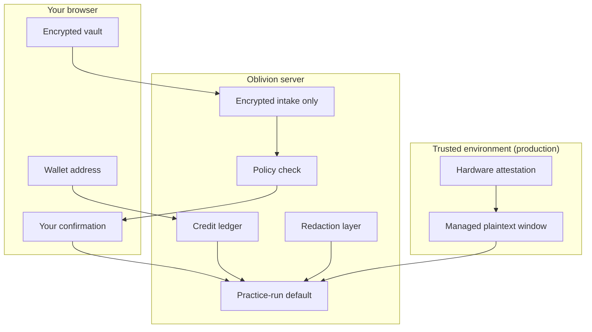

# Trust & Security

Oblivion minimizes trust surface area. Third-party services (brokers, search engines, breach checkers) may receive identifiers **only after you approve** a specific action.

---

## How Oblivion protects you

| Control | What it does |
|---------|----------------|
| Browser vault | Raw identifiers encrypted before anything is stored server-side |
| Server storage | Ciphertext plus minimal redacted metadata — not readable without your key |
| Policy | Blocks disallowed actions before AI or external tools run |
| Approval gates | Every sensitive send requires your explicit confirmation |
| Trust center | Hardware attestation before live sensitive connectors in production |
| Practice-run default | Live external sends stay behind approval and trust checks |
| Wallet credits | AI and email relay are metered; ledger entries contain no PII |

---

## Approval boundary

Every sensitive action binds: destination · action type · identifier categories · data disclosed · purpose · risk · expiry · **your confirmation**. Broad or vague consent is rejected.

---

## API authentication

| Surface | Credential | Notes |
|---------|------------|-------|
| Consumer `/api/*` | Case access token | Returned once at `POST /api/cases`; `Authorization: Bearer` on all other case routes |
| Partner `/v1/*` | Partner API key | Partner cases cannot use consumer `/api/*` |
| Trust | None | `GET /api/trust/attestation`, `GET /v1/trust/attestation` |

The browser stores tokens in `localStorage` (`oblivion.caseTokens`). There is no open case listing endpoint — the app keeps local summaries and fetches cases individually.

Details: [Consumer API](/docs/developers/consumer-api) · [Partner API](/docs/developers/partner-api)

---

## Never store in Oblivion

Passwords · full SSNs · government IDs · payment cards · recovery codes · unredacted identity documents

---

## Portable agent skill

The repo includes an installable cleanup workflow skill for other AI agents. Using it does **not** guarantee the host agent, logs, or model provider are private — review their policies separately.

---

## Self-hosting & production

Deploying Oblivion yourself? Production checklists, secrets, attestation, and executor modes are documented in the open-source repo:

- [SECURITY.md](https://github.com/thomasjvu/oblivion/blob/main/SECURITY.md) — production requirements and trust model
- [README.md](https://github.com/thomasjvu/oblivion/blob/main/README.md) — setup and configuration

Partners can verify deployment trust without authentication: `GET /v1/trust/attestation`