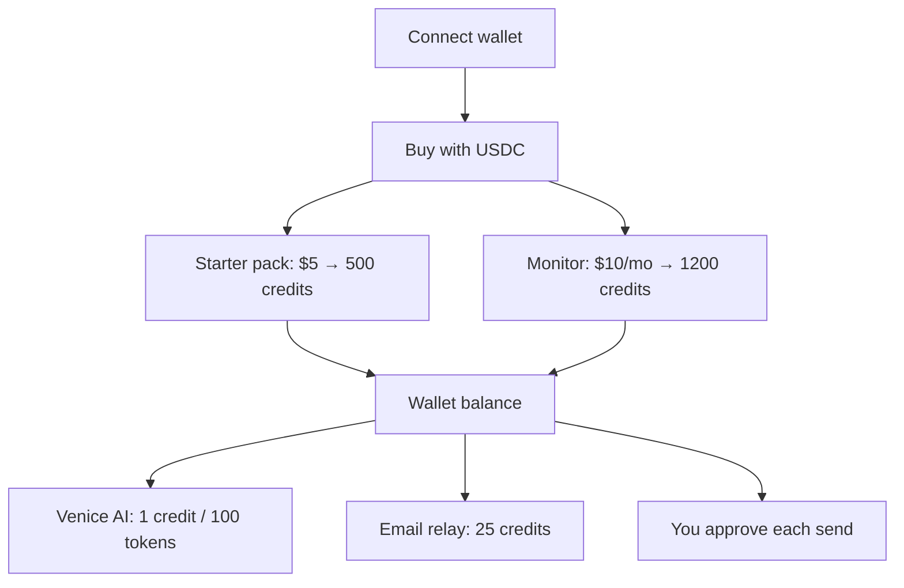

# Pricing

Oblivion uses a **wallet credit balance** — not per-case chat caps. Pay with **USDC on Base** via x402 and scoped payment permissions. Credits fund Venice AI and live operator email relay. **Every disclosure still needs your explicit approval.**

[Partner API billing](/docs/developers/partner-api) uses a **separate** partner credit pool — not wallet credits.

---

## Products

| Product | Price | Credits | API |
|---------|-------|---------|-----|
| **Starter pack** (`credit-starter`) | **$5 USDC** | **500** (one-time) | `POST /api/credits/purchase` |
| **Monitor** (`credit-monitor`) | **$10 USDC/mo** | **1,200** (monthly refill) | `POST /api/credits/monitor` |

Buy in the app: **Settings → Payment rails**. A scoped payment permission is required before settlement.

---

## What credits buy

| Use | Cost (default) |
|-----|----------------|
| Venice agent chat | 1 credit per 100 tokens (minimum 1) |
| Venice classify / draft / review | Same token metering |
| Live operator email relay | 25 credits per send |

**Token budget** scales with balance (roughly 120–4,000 max tokens per request). Usage is metered until credits run out — there are no fixed per-plan chat caps.

Core cleanup (discovery, approvals, practice-run execution) works **without** credits. Venice AI and live email relay require a connected wallet with sufficient balance.

---

## How it works

1. Connect wallet (sidebar)
2. Open **Settings → Payment rails** → buy Starter pack or subscribe to Monitor
3. USDC settles via x402 → credits land on your wallet balance
4. Venice and live relay debit credits per use
5. Approvals still gate every external disclosure

---

## FAQ

**Switch later?** Settings → Payment rails — Starter top-up or Monitor subscription.

**Bypass approvals?** No — credits fund AI and relay capacity only.

**Partner integrations?** See [Partner API](/docs/developers/partner-api) — separate metered pool, no wallet required.

**Running your own server?** See [SECURITY.md](https://github.com/thomasjvu/oblivion/blob/main/SECURITY.md) and [README](https://github.com/thomasjvu/oblivion/blob/main/README.md) for operator configuration.

[Open Oblivion](https://oblivion.phantasy.bot)