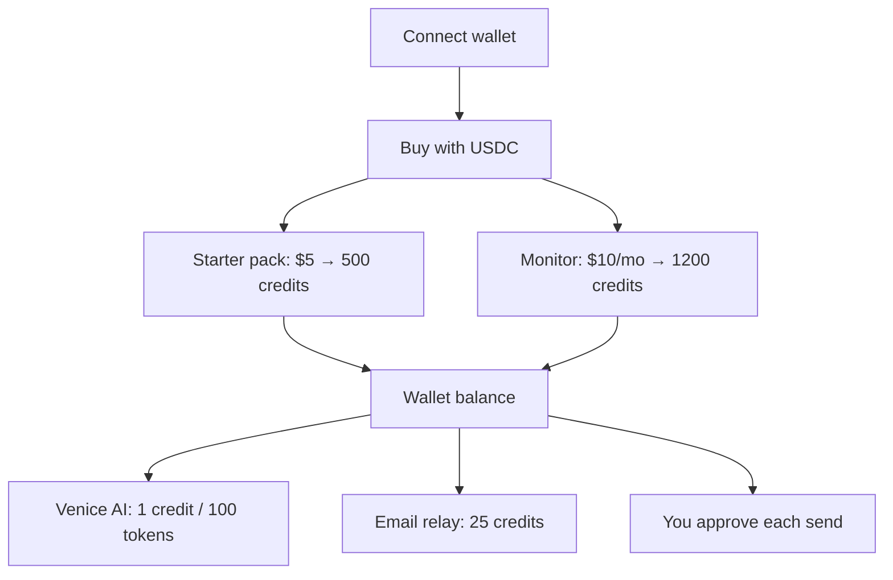

# Pricing

Oblivion uses a **wallet credit balance** — not per-case chat caps. Pay with **USDC on Base** via x402 and scoped payment permissions. Credits fund Venice AI and live operator email relay. **Every disclosure still needs your explicit approval.**

[Partner API billing](/docs/developers/partner-api) uses a **separate** partner credit pool — not wallet credits.

---

## Products

| Product | Price | Credits | API |
|---------|-------|---------|-----|
| **Starter pack** (`credit-starter`) | **$5 USDC** | **500** (one-time) | `POST /api/credits/purchase` |
| **Monitor** (`credit-monitor`) | **$10 USDC/mo** | **1,200** (monthly refill) | `POST /api/credits/monitor` |

Buy in the app: **Settings → Payment rails**. A scoped payment permission is required before settlement.

---

## What credits buy

| Use | Cost (default) |
|-----|----------------|
| Venice agent chat | 1 credit per 100 tokens (minimum 1) |
| Venice classify / draft / review | Same token metering |
| Live operator email relay | 25 credits per send |

**Token budget** scales with balance (roughly 120–4,000 max tokens per request). Usage is metered until credits run out — there are no fixed per-plan chat caps.

Core cleanup (discovery, approvals, practice-run execution) works **without** credits. Venice AI and live email relay require a connected wallet with sufficient balance.

---

## How it works

1. Connect wallet (sidebar)
2. Open **Settings → Payment rails** → buy Starter pack or subscribe to Monitor
3. USDC settles via x402 → credits land on your wallet balance
4. Venice and live relay debit credits per use
5. Approvals still gate every external disclosure

---

## FAQ

Billing-specific questions are summarized here. For product, privacy, approvals, and troubleshooting, see the full [FAQ](/docs/faq).

**Switch later?** Settings → Payment rails — Starter top-up or Monitor subscription.

**Bypass approvals?** No — credits fund AI and relay capacity only.

**Partner integrations?** See [Partner API](/docs/developers/partner-api) — separate metered pool, no wallet required.

**Running your own server?** See [SECURITY.md](https://github.com/thomasjvu/oblivion/blob/main/SECURITY.md) and [README](https://github.com/thomasjvu/oblivion/blob/main/README.md) for operator configuration.

---

## How Oblivion compares

Oblivion is a **supervised cleanup agent** — not a traditional “set and forget” data-broker subscription. You stay in the loop: identifiers live in a **browser vault**, and **every disclosure requires explicit approval**. Optional wallet credits pay for AI and live email relay; core discovery, approvals, and practice-run execution work without credits.

Competitor pricing and features below are from **public listings** (June 2026). Promotional coupons and regional offers change often — verify on each vendor’s site before buying.

### Starting price

| Service | Listed starting price | Billing model |
|---------|----------------------|---------------|
| **Oblivion** | **$0** (core workflow) · **$5** Starter pack · **$10/mo** Monitor | Pay-as-you-go credits; no subscription required for cleanup |
| [Optery](https://www.optery.com/) | ~$3.99/mo | Subscription |
| [Incogni](https://incogni.com/) | ~$7.99/mo | Subscription |
| [DeleteMe](https://joindeleteme.com/) | ~$8.71/mo | Subscription |
| [Aura](https://www.aura.com/) | ~$12/mo | Subscription |
| [Kanary](https://www.kanary.com/) | ~$14.99/mo | Subscription |
| [Privacy Bee](https://privacybee.com/) | ~$197/yr (~$16/mo) | Annual subscription |

### Feature comparison

| | **Oblivion** | Incogni | DeleteMe | Optery | Aura | Kanary |
|---|:---:|:---:|:---:|:---:|:---:|:---:|
| People-search / broker cleanup | ✓ | ✓ | ✓ | ✓ | ✓ | ✓ |
| Recurring / scheduled rechecks | ✓ | ✓ | ✓ | ✓ | — | ✓ |
| **Explicit approval before each send** | **✓** | — | — | — | — | — |
| **Identifiers encrypted in browser vault** | **✓** | — | — | — | — | — |
| Server stores only ciphertext + redacted metadata | ✓ | — | — | — | — | — |
| Manual removal requests | ✓ | ✓ | ✓ | ✓ | — | ✓ |
| Progress / case timeline | ✓ | ✓ | ✓ | ✓ | ✓ | ✓ |
| Open-source core + agent skill | ✓ | — | — | — | — | — |
| Partner / embed API | ✓ | — | — | — | — | — |
| Hardware attestation before sensitive live sends | ✓ | — | — | — | — | — |
| Core workflow without subscription | ✓ | — | — | — | — | — |
| Wide broker network (150+ sites) | — | ✓ | ✓ | ✓ | ✓ | ✓ |
| Identity / credit monitoring bundle | — | — | — | — | ✓ | — |
| Phishing / spam protection suite | — | ✓ | — | — | ✓ | — |
| Family plan | — | ✓ | ✓ | — | ✓ | ✓ |
| Money-back guarantee | — | ✓ | — | ✓ | ✓ | ✓ |
| 24/7 phone support | — | ✓ | ✓ | — | ✓ | — |
| Native mobile app | — | — | — | — | ✓ | — |

**Legend:** ✓ = marketed core feature · — = not a primary focus or not advertised

### When Oblivion fits

- You want **control and visibility** — nothing leaves without your sign-off on the exact disclosure.
- You prefer **local encryption** over handing identifiers to another company’s cloud vault.
- You may only need **occasional cleanup** (credits or free practice runs) instead of an always-on subscription.
- You’re building a **product** and need a [Partner API](/docs/developers/partner-api) with the same policy gates.

### When a subscription service may fit better

- You want a **fully managed, hands-off** broker-removal service with a large pre-negotiated broker list.
- You need **family coverage**, **identity theft insurance**, or **credit monitoring** in one bundle.
- You expect **24/7 human support** and formal money-back guarantees.

---

[Open Oblivion](https://oblivion.phantasy.bot)