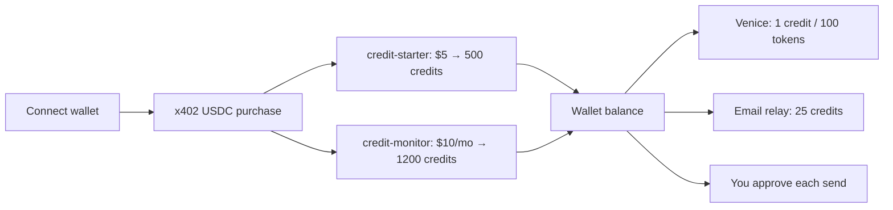

# Pricing

Oblivion uses a **wallet credit balance** — not per-case chat caps. Pay with **USDC on Base** via x402 + scoped ERC-7710 permissions. Credits fund Venice AI and live operator email relay. **Every disclosure still needs your explicit approval.**



[Partner API billing](/docs/developers/partner-api) uses a **separate** partner credit pool — not wallet credits.

---

## Products

| Product | Price | Credits | Endpoint |
|---------|-------|---------|----------|
| **credit-starter** | **$5 USDC** | **500** (one-time) | `POST /api/credits/purchase` |
| **credit-monitor** | **$10 USDC/mo** | **1,200** (monthly refill) | `POST /api/credits/monitor` |

Buy in the app: **Settings → Payment rails**. ERC-7710 scoped payment permission required before settlement.

---

## What credits buy

| Use | Cost (default) |
|-----|----------------|
| Venice agent chat | 1 credit per 100 tokens (minimum 1) |
| Venice classify / draft / review | Same token metering |
| Live operator email relay | 25 credits per send |

**Token budget** scales with balance (roughly 120–4,000 max tokens per request). No fixed “5 chats” or “6 analyses” — usage is metered until credits run out.

Core cleanup (discovery, approvals, record-only execution) works **without** credits. Venice AI and live email relay require a connected wallet with sufficient balance.

---

## Check balance

```sh
curl -s "http://localhost:8080/api/credits/balance?walletAddress=0xYourWallet" | jq
```

Also: `GET /api/credits/catalog` and `GET /api/x402/products` (products + rates).

---

## How it works

1. Connect wallet (sidebar)
2. Open **Settings → Payment rails** → buy starter or subscribe to monitor
3. x402 settles USDC → credits land on your wallet balance
4. Venice and live relay debit credits per use
5. Approvals still gate every external disclosure

Legacy session endpoints (`POST /api/x402/one-off`, `POST /api/agent/premium-task`) still exist; the UI uses `/api/credits/purchase` and `/api/credits/monitor`.

---

## Env overrides (operators)

| Variable | Default |
|----------|---------|
| `OBLIVION_STARTER_PACK_CREDITS` | 500 |
| `OBLIVION_MONITOR_MONTHLY_CREDITS` | 1200 |
| `OBLIVION_CREDITS_PER_100_TOKENS` | 1 |
| `OBLIVION_EMAIL_RELAY_CREDITS` | 25 |
| `OBLIVION_CREDITS_PER_USD` | 100 (partner invoice estimates) |

Dev only: `OBLIVION_CREDITS_BYPASS=true` or `OBLIVION_AI_BYPASS_PAYMENT=true`.

---

## FAQ

**Switch later?** Settings → Payment rails — starter top-up or monitor subscription.

**Bypass approvals?** No — credits fund AI and relay capacity only.

**Partner integrations?** See [Partner API](/docs/developers/partner-api) — separate metered pool, no wallet required.

[Open Oblivion](https://oblivion.phantasy.bot)