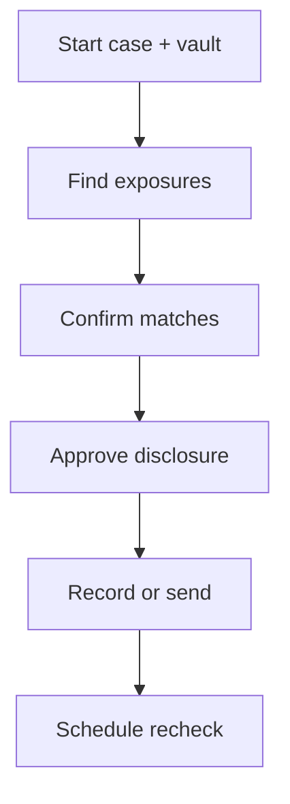

# Oblivion — User Guide

> **Beta — experimental software.** Use at your own risk. Approvals are your responsibility; this is not legal or security advice.

Oblivion is a private cleanup agent that removes your personal information from third-party data brokers **without asking you to give it to another middleman**. Your sensitive details stay encrypted in your browser; the server stores only encrypted blobs and redacted metadata. We discover people-search listings, draft broker opt-outs, run breach checks, and suppress search results — **nothing sends until you approve** the exact disclosure.

**Building an app?** [Partner API](/docs/developers/partner-api) · **Choosing a template?** [Templates](/docs/user-guide/templates)

Use the **agent panel** (right on desktop, bottom on mobile). Tap **Continue** when prompted.

---

## Start

1. **Start** → name, template, **Start cleanup**
2. Or type one line in the agent panel
3. Dashboard opens with your route running

Your browser stores a private **case access token** when a case is created. It is required for all server requests on that case and stays in local storage on this device — there is no email/password account.

### Two keys (wallet + case token)

| Credential | What it does |
|------------|--------------|
| **Wallet** | Credits, subscription, and per-case activation billing |
| **Case access token** | Authorizes `/api/*` for one case only |

Connect wallet to pay; keep the case token (or a **recovery kit** export) to reopen the case on another browser. After wallet connect, linked cases appear in the sidebar — you still need the token from your kit to access them.

**Free preview:** On the landing page, enter your name for a limited broker check (no wallet). **Start full cleanup** creates a case, requires wallet + activation, and runs Venice-scored discovery.

## Review

1. **Overview** — **Confirm** or **Not me** on each listing
2. Paste URLs or **Search again** if needed
3. **Continue** until approvals appear

## Approve

1. Open **Approvals** (or **Continue**)
2. Read destination, data categories, purpose
3. **Approve** only if it matches your intent — nothing sends without this

---

## Controls

| Button | Does |
|--------|------|
| **Continue** | Next safe step |
| Agent input | `run`, `status`, `explain` |

Sidebar: Overview · Approvals · Settings · Cases

## Credits and wallet

Starting a cleanup requires a **connected wallet** and a **paid credit purchase for that case** (Starter pack — 500 credits / $5 USDC — or Monitor subscription — 1,200 credits/month / $10 USDC). Until payment settles for the case, the dashboard stays on onboarding and workflow APIs return `case-activation-required`.

Metered features then debit the same wallet balance:

- **Full broker discovery** — 15 credits per sweep (Venice-scored)
- **Venice AI** (agent chat, classify, draft)
- **Live operator email relay** — 25 credits per send when enabled
- **x402 / Smart Account demos** — USDC on Base Sepolia

Monitor subscribers: monthly credit refill and new cases auto-activate for that wallet.

Buy or manage credits in **Settings → Payment rails**. See [Pricing](/docs/pricing).

---

## Stuck?

| Issue | Fix |
|-------|-----|
| No dashboard | Connect wallet, buy credits for this case, then **Start cleanup** |
| Blocked | Check **Approvals** |
| Wrong case | **Cases** → new or switch |
| Venice blocked | Connect wallet + buy credits in **Payment rails** |

More answers: [FAQ](/docs/faq)