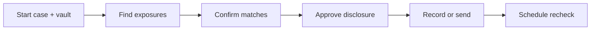

# Oblivion — User Guide

Private cleanup agent for people-search listings, breach checks, and search suppression. **Nothing sends until you approve** the exact disclosure.

**Building an app?** [Partner API](/docs/developers/partner-api) · **Choosing a template?** [Templates](/docs/user-guide/templates)

Use the **agent panel** (right on desktop, bottom on mobile). Tap **Continue** when prompted.

---

## Start

1. **Start** → name, template, **Start cleanup**
2. Or type one line in the agent panel
3. Dashboard opens with your route running

## Review

1. **Overview** — **Confirm** or **Not me** on each listing
2. Paste URLs or **Search again** if needed
3. **Continue** until approvals appear

## Approve

1. Open **Approvals** (or **Continue**)
2. Read destination, data categories, purpose
3. **Approve** only if it matches your intent — nothing sends without this

---

## Controls

| Button | Does |
|--------|------|
| **Continue** | Next safe step |
| Agent input | `run`, `status`, `explain` |

Sidebar: Overview · Approvals · Settings · Cases

## Credits and AI

Core cleanup (discovery, approvals, record-only steps) works **without** a wallet. Connect a wallet when you want:

- **Venice AI** (agent chat, classify, draft) — debits wallet credits per use
- **Live operator email relay** — 25 credits per send when enabled
- **x402 payment demos** — Smart Account / USDC on Base Sepolia

Buy credits in **Settings → Payment rails**: **Starter pack** — 500 credits ($5) — or **Monitor** — 1,200 credits/month ($10). See [Pricing](/docs/pricing).

---

## Stuck?

| Issue | Fix |
|-------|-----|
| No dashboard | Finish **Start cleanup** |
| Blocked | Check **Approvals** |
| Wrong case | **Cases** → new or switch |
| Venice blocked | Connect wallet + buy credits in **Payment rails** |