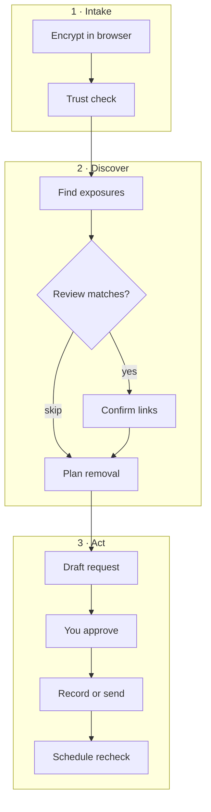

# Cleanup Templates

Pick the goal that matches your cleanup. Each template asks for different identifiers and follows the same supervised workflow: discover, review, approve, then record or send.

[User guide](/docs/user-guide/overview)

---

## Pick a template

| Goal | Template | Requirements | What you provide | Review each match? |
|------|----------|--------------|------------------|-------------------|
| Remove people-search listings | People-search cleanup | US, EU, or UK | Name, email, city/state | Yes |
| Hide Google results | Search suppression | US, EU, or UK | Name, email | No |
| California DROP request | California DROP | US case + **California residency** | Name, email, address | No |
| EU/UK erasure | GDPR erasure | **EU or UK** case | Name, email | No |
| Breach check | Breach exposure | US, EU, or UK | Email | No |
| Urgent address or relative exposure | High-risk safety | US, EU, or UK | Name, address, relative | Yes |
| Copied content takedown | Content takedown | US, EU, or UK; you control the original work | Name, email, URL, work reference | Yes |

**Requirements** are set when you start a case (jurisdiction) and by what the official route allows:

- **California DROP** — only for people who live in California. Oblivion guides and tracks the flow; you submit on the [official DROP site](https://privacy.ca.gov/drop/).
- **GDPR erasure** — only when your case jurisdiction is EU or UK (not US-only).
- **Content takedown** — you must be the rights holder or authorized to act for the work being copied.

Integrators: preset IDs and API details are in the [Partner API](/docs/developers/partner-api).

---

## What happens on every template

| Phase | What you experience |
|-------|---------------------|
| **Encrypt** | Identifiers stay in your browser vault; the server sees ciphertext and redacted labels only |
| **Trust check** | Production deployments verify hardware attestation before sensitive live sends |
| **Discover** | Oblivion finds candidate listings, breach signals, or guidance URLs |
| **Review** | You confirm or reject each match (some templates skip this) |
| **Plan removal** | Official opt-out, suppression, or rights paths are identified |
| **Draft** | Request text is prepared; AI can refine if you have credits |
| **Approve** | You read each disclosure card — nothing sends without your confirmation |
| **Execute** | Default is a logged practice run with handoff steps; live sends need trust verification + approval |
| **Follow up** | Replies are tracked; recheck is scheduled (typically 14–90 days) |
| **Complete** | Case finishes; you can return later if listings reappear |

**Autonomy:** Default mode shows one approval per destination. High-autonomy batches cards — you still approve each batch explicitly.

---

## What each template focuses on

- **People-search cleanup** — broker listings, opt-out paths, California DROP guidance where relevant
- **Search suppression** — Google removal planning; you complete submission on Google’s site
- **California DROP** — California-resident guided workflow on the official state registry (you complete submission)
- **GDPR erasure** — erasure templates plus search suppression planning
- **Breach exposure** — email breach check; password check uses prefix-only ranges, never full passwords
- **High-risk safety** — same discovery family as people-search with stricter match review
- **Content takedown** — DMCA-style drafts and platform abuse paths

---

## Never automatic

- Raw identifiers leaving the vault without your approval
- Live email or broker submission without production trust verification
- Passwords, SSNs, or breach-dump searches
- Broad consent — each action names destination, categories, purpose, and expiry

---

## Practice run vs live send

| Mode | What it means |
|------|----------------|
| **Practice run** (default) | Actions are logged with clear handoff instructions for you to complete |
| **Live send** | After you approve, Oblivion may transmit only the approved data — requires production trust verification |

[Open Oblivion](https://oblivion.phantasy.bot)