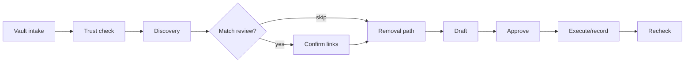

# Cleanup Templates

Seven **presets** define required identifiers, sources, disclosures, and typical timelines. Server is authoritative (`CLEANUP_PRESETS` in `cleanup.ts`); UI mirrors for selection only.

[User guide](/docs/user-guide/overview) · `GET /api/presets`

---

## Pick a template

| Goal | Preset | IDs needed | Match review |
|------|--------|------------|--------------|
| Remove Spokeo-style listings | `people-search-cleanup` | name, email, city/state | Yes |
| Hide Google results | `search-result-suppression` | name, email | Skip |
| California DROP | `california-drop` | name, email, address | Skip |
| EU/UK erasure | `gdpr-erasure` | name, email | Skip |
| Breach check | `breach-exposure` | email | Skip |
| Urgent address/relative exposure | `high-risk-safety` | name, address, relative | Yes |
| Copied content takedown | `content-takedown` | name, email, URL, work ref | Yes |

---

## Shared workflow (11 steps + complete)

| Step | What happens |
|------|----------------|
| **collect-minimum-identifiers** | Browser vault → ciphertext + redacted labels only |
| **verify-trust** | Phala TDX quote; sensitive connectors blocked until pass |
| **discover-candidates** | Brave, broker catalog, official guidance URLs |
| **confirm-matches** | You confirm each link (skipped for some presets) |
| **verify-removal-path** | Official removal / rights paths |
| **draft-actions** | Template text; Venice may refine if configured |
| **request-approval** | Disclosure cards — nothing sends until you approve |
| **execute-approved-action** | Record-only by default; live needs TEE + approval |
| **await-confirmation** | Track replies |
| **schedule-recheck** | 14–90 days depending on preset |
| **complete** | Done; recheck later for recurrence |

**Autonomy:** `approval-gated` (default) = one card per destination. `high-autonomy` = batched cards — still requires explicit approve.

---

## Key connectors per preset

| Preset | Connectors | Live / TEE |
|--------|------------|------------|
| people-search | broker sweep, guidance, opt-out live, DROP | opt-out live needs TEE |
| search suppression | google-removal-plan | User handoff only |
| california-drop | california-drop-guided | User handoff |
| gdpr-erasure | gdpr-template, google-removal-plan | Record / handoff |
| breach-exposure | hibp-email, hibp-password-range | email needs TEE; password prefix-only |
| high-risk-safety | same family as people-search | opt-out live needs TEE |
| content-takedown | dmca drafter, platform abuse | platform-abuse-live needs TEE |

---

## Never automatic

- Raw identifiers leaving the vault without approval
- Live email/broker without TEE pass
- Passwords, SSNs, breach-dump searches (policy-blocked)
- Broad consent — each action binds destination, categories, purpose, expiry

---

## Record-only vs live

| Mode | Behavior |
|------|----------|
| `record-only` (default) | Logged actions + handoff instructions |
| `live` | TEE-gated connectors may transmit approval-bound data |

Sensitive (`requiresManagedPlaintext`): `hibp-email`, `broker-opt-out-live`, `platform-abuse-live` — need `GET /api/trust/attestation` → `verifierResult: "pass"`.